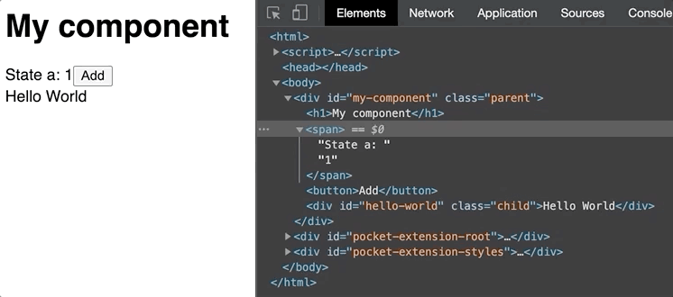
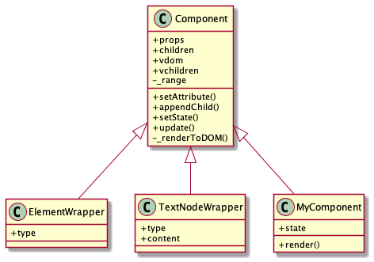

# Rebuild Wheel: React

Simple implementation of React, includes:

- Create React custom component
- Render custom component to DOM
- Manage component state and event
- Implement Virtual DOM
- DOM update based on Virtual DOM diff and update



## How React Works

A developer only need to define a custom component and call `render` function. React will be responsible for rendering it to a target DOM element and make it reactive. `render` function is the entry and key.

```js
// main.js
// Define custom component
class MyComponent extends Component {
    constructor() {
      // Init state
    }

    render() {
      // Return VDOM: usually an instance of ElementWrapper
    }
}
// 2. Render custom component to html
render(
  // 1. Transform JSX to component instance
  <MyComponent id="my-component" class="parent">
    <div id="hello-world" class="child">Hello World</div>
  </MyComponent>,
  document.body
)
```

### 1. Initialize: Transform JSX to component instance

Before `render` function is called, JSX transformer will call `createElement` first, whose goal is to:

convert **JSX**

```html
<MyComponent id="my-component" class="parent">
    <div id="hello-world" class="child">Hello World</div>
</MyComponent>
```

to component instance

```js
MyComponent {
  props: {id: "my-component", class: "parent"},
  children: [
    ElementWrapper {
      children: [TextWrapper],
      props: {id: "hello-world", class: "child"}
    }
  ],
  state: {a: 1, b: 2},
  vdom: {
    ElementWrapper {
      children: [
        ElementWrapper {props: {…}, children: Array(1), _range: null, type: "h1", vchildren: Array(1)},
        ElementWrapper {props: {…}, children: Array(2), _range: null, type: "span", vchildren: Array(2)},
        ElementWrapper {props: {…}, children: Array(1), _range: null, type: "button", vchildren: Array(1)},
        ElementWrapper {props: {…}, children: Array(1), _range: null, type: "div", vchildren: Array(1)}
      ]
    }
  }
}
```

In `MyComponent` initialization process:

- `props`: set attribues (`id`, `class`, etc.); bind events (`click`, etc.).
- `state`: set state
- `children`: walk through child components and repeat initialization process.
- `vdom`: walk through children and create `vdom` for each

`vdom` is a nested virtual DOM tree, with the root being `MyComponent`, and it will make DOM diff and patch be easier and more efficient.

### 2. Initialize: Render (VDOM) to DOM

This step will walk through the `vdom` tree and render each node in the tree (`vdom`) to the real DOM.

Once `render` function is finished, `MyComponent` will be rendered to target element, which is `document.body` in this case.

### 3. Update: VDOM diff and update

When **Add** button is clicked, state `a` will be changed, which will trigger VDOM diff process. This process will only update the minimal DOMs instead of the whole DOM tree.

The whole diff process is handled by `update` function. For simplicity and demo purpose, we will only compare old and new VDOM side by side with their same relative position in the tree structure. If the old VDOM and new VDOM have either different node type, prop, prop length or text content, we will mark them as different node and force the DOM update.

## Architecture Design

In high level, it would be ideal if we could manipulate element (`div`, `span`, etc.), text node (`#text`) and custom React component with same interface. In order to achieve that, we could:

- Create same interface: `Component` class
- Add a wrapper (`Adapter` pattern) to element, text node so all elements could share same interface
- Inherit all element from `Component`



### `Component`

A `Component` contains a virtual DOM.

| Attribute | Description |
|---|---|
| props | Element props, such as `id`, `class` |
| children | Child component |
| vdom | Component virtual DOM. Equal to self for element and text node |
| vchildren | Child VDOMs |
| type | Type of element: `div`, `#text`, etc. Only available for DOM element and text node |
| state | Component state. Only available for custom component |
| content | Content of text node. Only available for text node |

| Method | Description |
|---|---|
| setAttribute | Keep consistent with DOM element API |
| appendChild | Keep consistent with DOM element API |
| setState | Update component state |
| render | Return a `Component` |
| update | VDOM diff and patch to avoid whole DOM tree update |

## How to Run

Install dependencies:

```bash
npm install
```

Start webpack server:

```bash
npm run start
```

Go to http://localhost:8080/
